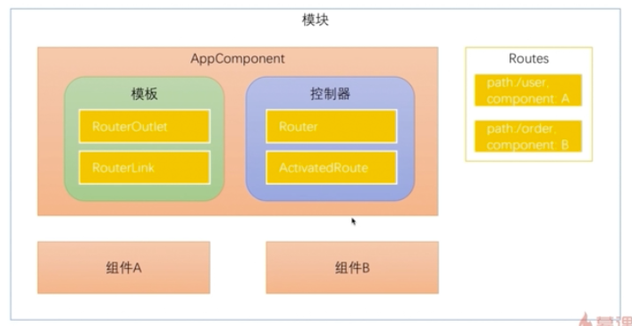
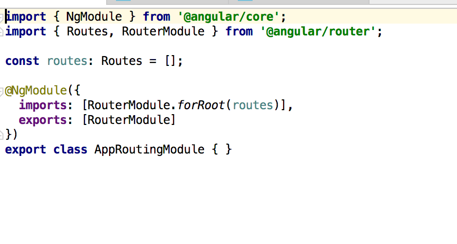
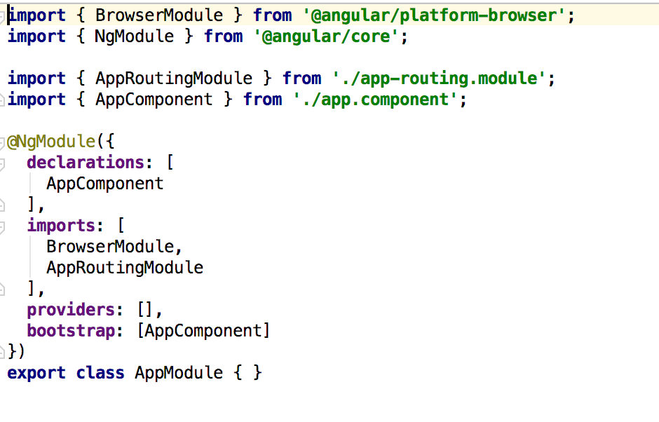
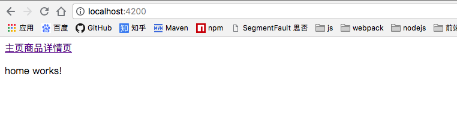
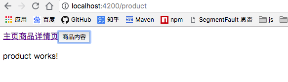

### AngularJs
    
  简介：
  AngularJs是谷歌发布的一个前段框架
1. AngularJs程序架构（组件，指令，服务可以构成一个模块）

<div align='center'>
   
</div>
&nbsp;&nbsp;&nbsp;&nbsp;&nbsp;&nbsp;&nbsp;&nbsp;AngualrJs运行至少需要一个模块，一个组件。

2. 安装angular-cli工具


3. AngularJs常用概念
+ 组件的必备元素
    
   （1）装饰器(@Component)-组件元数据装饰器，用来告知Angular框架如何处理TypeScript类
   
   （2）模版(Template) -定义组件的外观，以HTML的形式存在，告知Angular如何渲染
   
   （3）控制器(Controller) ---控制器处理模版上发生的事件
   
+ 可选属性
   （1）输入属性(@Inputs())---传递数据给子组件
   （2）提供器（providers）---用来做依赖注入
   （3）生命周期钩子 ---根据组件的状态执行逻辑
   （4）样式表(styles)
   （5）动画
   （6）输出属性(@Outputs)

4. @Component 组件元数据装饰器
    Angular通过这个属性，就知道定义个的一个TypeScript类是组件了。@Component中的属性就告诉angular如何定义的组件。
    - select："app-root"。告诉angular可以通过这个名字来引用组件
    
    - templateUrl:'./app.component.html'  告诉Angular如何渲染这个组件
    
    - styleUrls: ['./app.component.css']  组件加载的css文件
    
5. 控制器(controller)

    文件中定义的TypeScirpt类就是控制器，里面包含了数据，逻辑等。
    
6.指令生命周期概述
+ 指令与组件共有的钩子
  
  ngOnChanges
  
  ngOnInit
  
  ngDoCheck
  
  ngOnDestroy
  
+ 组件特有的钩子
  ngAfterContentInit
  
  ngAfterContentChecked
  
  ngAfterViewInit
  
  ngAfterViewChecked
  
### 第二章：开始Angular开发

### 第三章：Angular路由
1. 学习内容
+ 了解路由的基础知识
+ 子路由，保护路由和辅助路由

2. 什么是SPA应用？
    
    一个应用中只有一个主入口，剩下的更新只是内容的改变的应用我们称之为单页应用。Angular应用就是SPA，内容改变只会刷新局部的组件内容。
路由器的作用为某个内容分配一个url。SPA可以理解成一个视图的集合。

3. 路由基础   
 
    (1) 如何使用Anuglar-cli创建一个带有路由模块的Angular项目？
    ```
    ng new router --routing
    ```
    (2) 使用Angular Route导航

    Routes: 路由配置，保存，保存着哪个URL对应展示哪个组件，以及在哪个RouterOutlet中展示组件
    
    RouterOutlet：在HTML中标记路由内容呈现位置的占位符指令
    
    Router：负责在运行时执行路由的对象，可以通过调用其navigate()和navigateByUrl()方法来导航到一个指定的路由
    
    RouterLink：在HTMl中声明路由导航用的指令
    
    ActivatedRoute：当前激活的路由对象，保存着当前路由的信息，如路由地址，路由参数等。
    
    (3) Angualr Route的调用过程。
    <div align='center'>
        
    </div>
    Angular会根据Routes中的路由配置，关联对应的组件，当路由触发时，会调用对应的组件显示在模版中。在模版中可以定义路由插座，来指定路由对应的组件在模版
    中的显示位置。我们可以通过Angular routerLink标签的形式来指定路由的跳转信息，同时也可以通过在控制其中使用Router对象来控制路由的跳转。
    
    (4) 如何在Anuglar中配置路由模块？
    
    使用`ng new router --routing`命令生成的项目中会自带一个app-routing.module.ts文件，这个文件中包含着路由的一些配置信息。当然我们也可以直接在app.module.ts中直接配置路由模块的依赖。
    
     <div align='center'>
            
      </div>
     <div align='center'>
         
     </div>
     
     ```
        const routes:Routes=[
            {
                path:'',
                component:'',
                children:[]
            }
        ]
     ```
     path属性表示路由的路径，children表示子路由的配置信息,component表示路由指向的组件。
     
     (5) 现在我们通过一个小案例来介绍路由的一些用法
     
     现在我们有一个HomeComponent组件，一个ProductComponent组件，使用`ng g component home`命令来生成组件。然后在路由的配置文件中进行路由配置
     
     ```
        import { NgModule } from '@angular/core';
        import { Routes, RouterModule } from '@angular/router';
        import {HomeComponent} from './home/home.component';
        import {ProductComponent} from './product/product.component';
        
        const routes: Routes = [
          {path: '', component: HomeComponent},
          {path: 'product', component: ProductComponent},
        ];
        
        @NgModule({
          imports: [RouterModule.forRoot(routes)],
          exports: [RouterModule]
        })
        export class AppRoutingModule { }

     ```
     上述代码中要注意，配置路由的地址时不能加'/'，因为在配置中默认是跟路经。好了，接下来我们修改app-component.html文件的内容，通过点击a标签的内容，可以进行路由的跳转。
     
     ```
        <a [routerLink]="['/']">主页</a>
        <a [routerLink]="['/product']">商品详情页</a>
        <router-outlet></router-outlet>
     ```
     我们使用[routerLink]指令来进行路由的跳转，这里我们写路由的地址时为什么要加上['/']这种形式呢？原因很简单，我们经常会遇到这种情况，在路由的地址中需要加上参数信息的链接
     通过这种形式，我们可以很轻松的配置参数信息。当然如果在没有路由参数的情况下，我们直接写上路由地址的字符串也是ok的。至此，我们就完成了一个简单的路由跳转的代码。运行`npm start`
     启动angualr项目，在浏览器中点击链接可以发现，内容已经可以切换了。
     
      <div align='center'>
          
      </div>
      至此，我们通过angular中路由指令完成了一个简单的路由跳转功能，接下来我们看一下如何通过在控制器中使用Router对象来控制路由的跳转。
        
      首先我们需要在html中添加一个按钮，添加这个按钮的目的是，点击按钮时能够触发控制器中的事件处理函数，然后在事件处理函数中做路由跳转的操作。
      
      ```
        <a [routerLink]="['/']">主页</a>
        <a [routerLink]="['/product']">商品详情页</a>
        <button (click)="toProductPage()">商品内容</button>
        <router-outlet></router-outlet>
      ```  
      在html代码中我们看到了一个新的指令(click),通过（）+ 事件名的形式我们可以很轻松的绑定事件。关于事件绑定的内容，将会在后续的章节中详细介绍。
     
      接下来，我们修改在app-component.ts中的代码如下：
      
      ```
        import { Component } from '@angular/core';
        import {Router} from '@angular/router';
        
        @Component({
          selector: 'app-root',
          templateUrl: './app.component.html',
          styleUrls: ['./app.component.css']
        })
        export class AppComponent {
          title = 'app';
          constructor(private router: Router) {}
          toProductPage() {
            this.router.navigate(['/product']);
          }
      ```
      
      代码中我们使用到了构造函数，注入了一个Router对象，这样在这个组件中我们就可以使用router了。这里对象是通过构造函数，依赖注入进组件的。有关依赖注入的知识点也会在
       后续章节中详细介绍。最后我们在事件处理函数中调用router的navigate方法，进行路由跳转。好了，这下我们的通过Router对象进行路由跳转功能也已经完成了。接下来我们可以
       看一下效果：
       <div align='center'>
            
       </div>
       
      最后，关于路由的信息，还有一点补充，目前路由跳转的时候都是有对应的组件的，当输入的路由没有相关组件对应时我们应该如何配置呢？很简单，我们只需要在生成一个404组件，然后在
      路由配置中，配置一下匹配规则就可以了。
      ```
        const routes: Routes = [
          {path: '', component: HomeComponent},
          {path: 'product', component: ProductComponent},
          {path: '**', component: Code404Component},
        ];
      ```
      将path设置为**，就可以匹配任意规则了，注意路由匹配的过程是从上之下的，当匹配到了相关的路由，后面的路由就不会继续匹配了，所以类似这种404的路由匹配，应该放在路由的最后。
       
      (6) 如何在路由中传递参数
        
      通过上一节的学习我们知道了，如何使用路由来做跳转，在这一节中我们将会学习如何在路由中传递参数。
      
      在路由中传递参数的方式主要有三种：
        
      + 在查询参数中传递数据
      + 在路由路径中传递数据
      + 在路由配置中传递参数 
      
+ 在查询参数中传递数据

    如何在html中传递：使用指令[queryParams]='{id:1,name:"lisi"}'
    ```
        <a [routerLink]="['/']">主页</a>
        <a [routerLink]="['/product']" [queryParams]="{id:123}">商品详情页</a>
        
        <button (click)="toProductPage()">商品内容</button>
        <router-outlet></router-outlet>
    ```
    queryParams中的参数对象，也可以直接关联到，controller中设置的属性。
    
    如何在控制器中获取：使用ActivatedRoute对象获取
    ```
        import {Component, OnInit} from '@angular/core';
        import {ActivatedRoute} from '@angular/router';
        
        @Component({
          selector: 'app-product',
          templateUrl: './product.component.html',
          styleUrls: ['./product.component.css']
        })
        export class ProductComponent implements OnInit {
        
           productId: number;
        
          constructor(private routerInfo: ActivatedRoute) {
          }
        
          ngOnInit() {
            this.productId = this.routerInfo.snapshot.queryParams['id'];
          }
        
        }

    ```
+ 在路由路径中传递数据 
    
    在路由路径中传递数据，主要分为三步：
    + 在路由配置中给路由加上参数： ` {path: 'product/:id', component: ProductComponent}`
    
    + 在传递参数的组件中，加上参数值: `<a [routerLink]="['/product',123123]">商品详情页</a>`
    
    + 在接受参数的组件中接收: ` this.productId = this.routerInfo.snapshot.params['id'];`  
    
+ 什么是参数快照，和参数订阅  
    
    上面那种获取参数信息的方式我们称之为参数快照。参数快照会存在一个问题，当一个组件从自身跳转到自身时，如果组件的属性值都没有发生变化，只是路由传递的参数值发生了
    变化，那么在组件中获取参数的值是不会发生变化的。那么这就会存在着一个问题，数据没有刷新。这个时候我们就可以使用参数订阅的方式，来订阅参数的改变。
    `  this.routerInfo.params.subscribe(params => this.productId = params['id']);`
    这样我们就可以实时的监听参数的变化了。subscribe是rtjs中的内容，这个在以后的内容中会详细介绍。
    

4. 重定向路由
    
    在用户访问一个特定的地址时，将其重定向到另一个指定的地址。
    
    ```
        const routes:Routes=[
        {path:'',redirectTo:'/home',pathMatch:'full'},// 重定向到home
        {path:'home',compenent:HomeComponent},
        
        ]
    ```
    
    
5. 子路由
    在主目录中会有一个<router-outlet>插座，显示子路由的信息。子路由中也是可以传递参数的。组件本身不知道任何路由相关的信息，都是在组件内部，
    或者配置文件中，配置的。形成的是一个插座的父子关系。
        语法：
     ```
        {path:'home',component:HomeComponent,children:[
            {path:'xxx',component:XXXComponent}
            {path:'yyy/:id',component:YYYComponent}
        ]}
        
        <a [routerLink]="['./']">商品描述</a>
        <a [routerLink]="['./seller',99]">销售信息</a>
        <router-outlet></router-outlet>
        
        
     ```
     
6. 辅助路由
    
    允许你定义多个插座
    ```
    <router-outlet></router-outlet>
    <router-outlet name='aux'></router-outlet>
    
    {path: 'xxx',component:XxxComponent,outlet:"aux"}
    {path: 'yyy',component:YyyComponent,outlet:"aux"}
    
    <a [routerLink]="[{outlets:{primary:'home',aux:'xxx'}}]">Xxx</a>
    <a [routerLink]="[{outlets:{aux:'yyy'}}]">Xxx</a>
    
    ```
    可以通过配置primary设置主路由
    
7. 路由守卫
    
   只有当用户已经登陆并拥有某些权限时灿能进入某些路由
   
   一个由多个表单组件组成的向导，例如注册流程，用户只有在当前路由的组件中填写了满足要求的信息才可以导航到下一个路由。
   
   当用户未执行保存操作而视图离开当前导航时提醒用户
   
   （1） 三种路由守卫
     + CanActive: 处理导航到某路由的情况
     
     + CanDeactivate: 处理当前路由离开的情况
     
     + Resolve：在路由激活之前获取路由数据
     
     就是设置了很多钩子函数
     
 + CanActive
  
    第一步生成守卫对象 login.guard.ts类
     
     ```
        import {CanActivate} from '@angular/router'
        
        export class LoginGuard implements CanActivate{
            canActivate(){
                let loggedIn:boolean =Math.random() <0.5
                
                if(!loggedIn){
                    console.log('用户未登陆！')
                }
                return loggedIn;
            }
            
        }
     ```
     
     第二步 在路由配置中配置守卫的信息
     
     ```
        {path:'home',component:HomeComponent,children:[],canActivate:[LoginGuard]}
      ```
        
     第三步 实例话login.guard类
     
     在@NgModule中的providers属性主添加这个类就ok
     
     
+ CanDeactive
    
      第一步生成守卫对象 Unsaved.guard.ts类。CanDeactive类必须要指定保护的是哪个组件，即离开组件时能够得到通知
       
       ```
          import {CanDeactivate} from '@angular/router'
          import {ProductComponent} from '../product/product.component'
          
          export class UnsavedGuard implements CanDeactivate<ProductComponent>{
              canDeactivate(component:ProductComponent){
                 return window.confirm("您还没有保存确定要离开吗？")
              }
              
          }
       ```
       
       第二步 在路由配置中配置守卫的信息(属性值时数组，可以配置多个守卫)
       
       ```
          {path:'home',component:HomeComponent,children:[],canActivate:[LoginGuard],canDeactive:[UnsavedGuard]}
        ```
          
       第三步 实例话login.guard类
       
       在@NgModule中的providers属性主添加这个类就ok
       
       
            
+ resolve守卫（可以预先在组件加载之前去服务器上读数据）
    
      第一步生成守卫对象 product.resovle.ts类。CanDeactive类必须要指定保护的是哪个组件，即离开组件时能够得到通知
       
       ```
          import {Resovle} from '@angular/router'
          import {ProductComponent} from '../product/product.component'
          @Injectable
          export class ProductResolve implements Resolve<ProductComponent>{
          
            constructor(private router:Router){
            }
             resolve(route:ActivatedRouteSnapShot,state:RouterStateSnapshot):Observable<Product>|Promise<Product>|Product{
                 let productId:number=router.parmas["id"];
                 
                 if(productId==1){
                    return new Product(1,"iphone8")
                 } else {
                    this.router.navigate(['/home']);
                    return undefined;
                 }   
             }
          }
       ```
       
       第二步 在路由配置中配置守卫的信息(属性值时数组，可以配置多个守卫)
       
       ```
          {path:'home',component:HomeComponent,children:[],canActivate:[LoginGuard],canDeactive:[UnsavedGuard],resolve:{
            product:ProductResovle
          }}
        ```
          product是传递给组件的数据
       第三步 实例话login.guard类
       
       在@NgModule中的providers属性ProductResolve
      
    
     
     
   
    
     
        
        
    

  
    

### 第四章：Angular依赖注入
1. 学习内容
    
 + 什么是依赖注入模式以及使用依赖注入的好处
 + 介绍angular的依赖注入实现：注入器和提供器
 + 注入器的层级关系
 
2. 什么是依赖注入，使用依赖注入的好处？
   
   依赖注入：Dependency Injection简称DI
   
   <div align='center'>
      
   </div>
     
   providers:[{provider:ProductService,useClass:ProductService}]
    
   provider相当于是一个token，useClass表示这个token对应的实体类，需要new一个这个类型的实体类
   
  依赖注入的特性：松耦合，可测性

3. 注入器是构造函数，提供器是配置中的provider属性    

     <div align='center'>
          
       </div>
       
     生成服务的命令是：ng g service service.name
     
     当一个提供器声明在模块中时，任何组件都是可以用的。组件中也是可以声明提供器的。服务中也是可以注入其他服务的。服务需要加上@Injectable注解，这个注解的意思是表示
     可以注入其他依赖
     
     工厂提供器：当我们不能仅仅只是通过new来创建一个对象时，我们就需要使用工厂提供器来创建对象
     
     ```
        providers:[{
            provide:ProductService,
            useFactory:(logger:Loggerservice,config)=>{
               // let logger =new LoggerService();
               // let dev =Math.random()>0.5;
                if(config.isDev){
                    return new ProductService(logger);
                }else{
                    return new AnotherProductService(logger);
                }
            },
            deps:[LoggerService,"IS_DEV_ENV"]   //依赖
        },Loggerservice，{
            provide:"IS_DEV_ENV",useValue:{isDev:false}
        }]
        
        工厂方法创建的对象是单例的,变量也是可以跟服务一样，注入的。但是不是useClass而是useValue，useValue可以是任何类型。
        考虑一下如何在其他组件中使用变量
     ```
4. 注入器的层级关系
    应用级注入器，主组件注入器，子组件注入器
    
    找对应的提供器时，先从子组件开始搜索注入器，没有找到就向上搜索，知道搜到位置，如果到了应用级注入器还没有搜到，则会抛出异常。
    
    如何手动的注入服务
    
    ```
        constructor(private injector:Injector){
            this.productService=injecor.get(ProductService);
        }
    ```
 

### 第五章：数据绑定，响应式编程和管道

1. 学习内容
+ 数据绑定

+ 响应式编程

+ 管道

2. 数据绑定
    

### 第六章：组件间的通信

### 第七章： 表单处理

### 第八章：与服务器间的通信
### 第四章：依赖注入

1. 什么是依赖注入，使用依赖注入的好处？

    依赖注入：Dependency Injection简称DI
    
    
+ 依赖注入的好处？

    帮助我们以一种松耦合的方式来编写代码。

2. Angular的依赖注入的实现：注入器和提供器

+ 注入器
```
    constructor(private productService:ProductService){...}
``` 
 &nbsp;&nbsp;&nbsp;&nbsp;&nbsp;&nbsp;&nbsp;&nbsp;&nbsp;构造函数中声明我需要一个ProductService这样一个token，new出来的实体类，会根据提供器中定义的token对应的类型来实例化这个依赖
+ 提供器

    provider:[ProviderService]
    
    等价于
    
    providers:[{provider:ProductService,useClass:ProductService}]
    
    provider相当于是一个token，useClass表示这个token对应的实体类，需要new一个这个类型的实体类
    
    
3. 注入器的层级关系

@Injectable() 装饰器是指当前的服务可以注入其他的服务，并不是理解为当前服务可以被注入。Component中的Controller并没有使用@Injection()装饰器来修饰，但是也可以使用构造函数来注入需要的服务，这是因为Angular给组件使用了@Component装饰器，而这个装饰器和管道装饰器是@Injection装饰器的子类。

Angular中注册一个服务时，一定要在模块的配置中的providers属性中添加相应的服务名

建议所有的服务在创建时都加上，@Injectable装饰器

Angular框架只有一个依赖注入点，就是通过构造函数注入。


### 第五章：数据绑定，响应式编程和管道

1. 数据绑定（angular中数据默认的是单项绑定的）

+ 事件绑定
    
    （eventName）元素中使用（）表示绑定事件，eventName表示事件名。

+ 属性绑定
    
    angular中的插值表达式和属性绑定其实是一回事。
    
    angular中HTML属性和DOM属性的区别？
    HTML属性是指元素的初始值，不会被改变的
    DOM属性的值是可以被改变的，例如input框在输入时，DOM属性就会被改变，HTML属性不会改变
    
    模版绑定是i 通过DOM属性和事件来工作的，而不是HTML属性。
