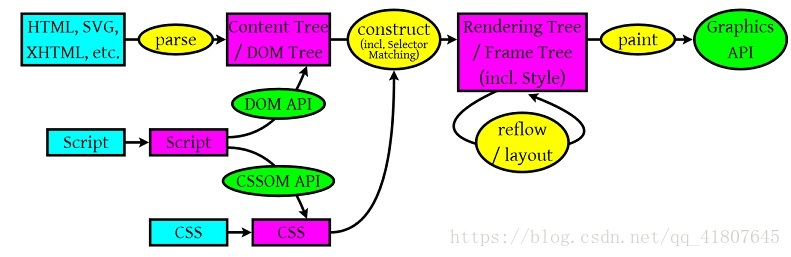
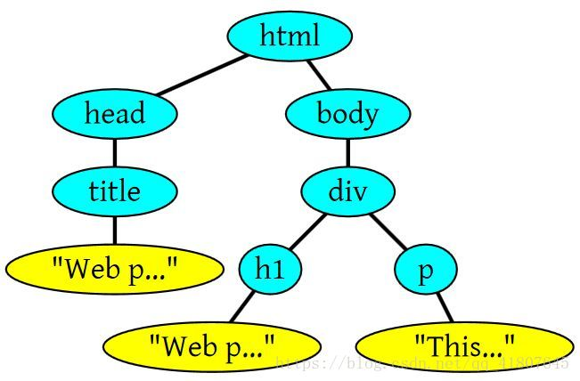
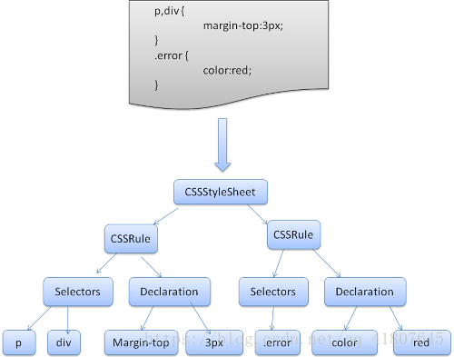

#### 1. 浏览器渲染过程解析——从URL到页面显示

一、浏览器简介
>浏览器是使用最广泛的软件之一，主要功能是向服务器发出请求，在浏览器窗口中展示用户需要的网络资源。资源的位置由用户的的URI（Uniform Resource Identifier统一资源标识符）来指定，通过DNS查询，将网址转换为IP地址。资源的格式通常是HTML，也包括PDF、image及其他格式。整个浏览器工作的流程，主要如下：

&nbsp;&nbsp;用户输入网址——浏览器查找IP地址——发送HTTP请求——服务器处理请求并响应——服务器发回HTML响应——浏览器开始解析HTML——浏览器发送请求获取HTML中内嵌的对象，如CSS/JS/图片等资源——浏览器展示完整页面</p>

二、 浏览器渲染流程

   
   
从这张经典的图中可以看出以下几点：

    1，浏览器可以解析的资源，HTML，SVG，XHTML等，解析完会生成DOM Tree。

    2，CSS资源会解析成CSS Rule Tree。

    3，JS通过DOM API和CSSOM API来操作DOM树和CSS树。

    4，解析完成后综合DOM树和CSS树会生成Rendering Tree，计算每个元素（Frame）的位置，这个过程就是layout或者叫reflow过程。

    5，调用操作系统Native GUI的API绘制。

注意：上述这个过程是理论上是逐步完成的，但是实际实现中为了更好的用户体验，渲染引擎为了尽可能早的将内容呈现到屏幕上，会在构建DOM树的同时去解析CSS构建CSS树，并且还会去生成Rendering Tree。解析完一部分内容就显示一部分内容，同时，可能还在通过网络下载其余内容，这样就可以更快的显示出页面，其中解析后面的内容涉及到布局和样式的改变引起的reflow过程和repaint，我们后面在详细说明。

<strong>三、HTML解析与DOM树构建</strong>

&nbsp;&nbsp;&nbsp;&nbsp;HTML解析这方面没啥好说的，大致流程是浏览器使用词法分析器和解析器将HTML内容解析成为语法树，也就是DOM树，DOM 树的构建过程是一个深度遍历过程：当前节点的所有子节点都构建好后才会去构建当前节点的下一个兄弟节点。

&nbsp;&nbsp;&nbsp;&nbsp;DOM树是由DOM元素和属性节点组成，DOM是文档对象模型（Document ObjectModel）的缩写，是HTML文档的对象表示，同时也是外部内容与HTML元素之间的借口。

  具体解析与构建过程如下：
```
<html>
<html>
<head>
    <title>Web page parsing</title>
</head>
<body>
    <div>
        <h1>Web page parsing</h1>
        <p>This is an example Web page.</p>
    </div>
</body>
</html>
```
  上面的这段HTML会解析成如下的DOM树结构：
  
  
  
<strong>三、CSS解析</strong>

> CSS解析的过程类似于HTML解析，也是浏览器使用自带的解析器进行解析，一般解析过程是由上而下，会将CSS文件解析成为StyleSheet对象，且每个对象都包含CSS规则。CSS规则对象包含了选择和声明对象，以及其他与CSS语法对应的对象。CSS解析完成后会大致生成如下结构的CSS Rule Tree。



<strong>五、渲染</strong>

渲染的主要过程分为——Render Tree（渲染树）生成——Layout（布局）——Paint（绘制）。

 1. Render Tree的生成
> DOM树和CSS树结合生成Render Tree（渲染树）——这是由可视化元素按照其显示顺序组成的树形结构，是文档可视化的表示，它的作用是让浏览器能够按照正确的顺序渲染页面元素。Firefox中称之为“框架”，Webkit中的术语则是呈现器或者呈现对象。
        渲染树是和DOM元素相对应的，但是并非全部一一对应，例如：1，非可视化元素是不会出现在渲染树中，如“head”元素，2，如果元素的display属性值为“none”，也不会出现在渲染树中（但是visibility属性值为“hidden”的元素会出现在渲染树中。

 2. 布局
> 渲染树中并不包含位置和大小的信息，计算这些值的过程就是布局或者重排。 布局的过程是一个递归的过程，从根元素开始，递归遍历部分或者所有的渲染树结构，并为每一个需要显示元素计算几何信息。一般根元素位置坐标（0，0），大小为浏览器窗口的可见区域。

 这里涉及到两个重要的概念reflow和repaint：
 + repaint（重绘）：元素的某一部分属性发生改变，如字体颜色，背景颜色等改变，尺寸并未改变，这时发生的改变过程就是repaint。
 + reflow（回流）： 因为浏览器渲染是一个由上而下的过程，当发现某部分的变化影响了布局时，就需要倒回去重新渲染，这个过程就称之为reflow。reflow几乎是没法避免的，现在一些常用的效果，比如树状目录的折叠、展开（实质上是元素的显示与隐藏）等，都将引起浏览器的 reflow。鼠标滑过、点击……只要这些行为引起了页面上某些元素的占位面积、定位方式、边距等属性的变化，都会引起它内部、周围甚至整个页面的重新渲染。基本上能引起reflow的主要有几个原因

    （1） 网页初始化。

    （2）JS操作DOM树的时候，增加删除元素等。

    （3）某些元素的尺寸改变。

    （4）CSS属性的改变，
    
    但是浏览器很聪明，为了避免细小的改变就进行repaint或者reflow，浏览器采用一种"dirty"系统，会将这些改变操作积攒一批，然后做一次reflow，这又叫异步reflow或增量异步reflow。但是有些特殊情况不会这么做，比如：resize窗口，改变了页面默认的字体，等，对于这些操作，浏览器会马上进行reflow。
    
    但是有的时候，我们自己编写的脚本会阻止浏览器的这种操作，比如我们请求下面的值的时候：offsetTop, offsetLeft, offsetWidth, offsetHeight，scrollTop/Left/Width/Height，clientTop/Left/Width/Height，IE中的 getComputedStyle(), 或 currentStyle等，如果我们的程序运行的时候需要这些值，那么浏览器需要给我们返回最新的值，而这样就会将当前积攒的操作执行，从而引起频繁的reflow或者repaint。
    
    通常reflow比repaint会耗费更多的时间，从而也就会影响性能，所以编写代码的时候要尽可能避免过多的reflow或者repaint。减少reflow/repaint的方法：
    
    （1）修改样式不要逐条修改，建议定义CSS样式的class，然后直接修改元素的className。
    
    （2）不要将DOM节点的属性值放在循环中当成循环的变量。
    
    （3）为动画的 HTML 元素使用 fixed 或 absoult 的 position，那么修改他们的 CSS 是不会 reflow 的。
    
    （4）把DOM离线后修改。如设置DOM的display：none，然后进行你需要的多次修改，然后再显示出来，或者clone一个节点到内存中，然后随意修改，修改完成后再与在线的交换。
    
    （5）千万不要使用table布局，一个微小的改变就可能引起整个table的重新布局。
      
     table布局的缺点：
     + table比其它html标记占更多的字节。(造成下载时间延迟,占用服务器更多流量资源)      
     + table会阻挡浏览器渲染引擎的渲染顺序。(会延迟页面的生成速度,让用户等待更久的时间)     
     + 在某些浏览器中,table里的文字的拷贝会出现问题。(会让用户不悦)生成速度,让用户等待更久的时间)     
     + table会影响其内部的某些布局属性的生效(比如\<td>的元素的height:100%) (限制页面设计的自由性)     
     
     + table里显示图片时需要你把单个、有逻辑性的图片切成多个图。(增加设计的复杂度,增加页面加载时间,增加http会话数)     
    
 3. 绘制
 
    在绘制阶段，系统会遍历渲染树，并且调用呈现器将的“paint”方法，将内容显示在屏幕上。同样，类似于布局过程，也分为全局和增量两种。更多绘制详情参考文末资料。

   
<strong>六、性能优化</strong> 

1 提升HTML加载速度
  + 页面精简，删除不必要的注释，空格，将内嵌的JS和CSS移至外部文件，使用压缩工具等。
    
  + 减少文件数量，减少页面上引入的文件数量可以减少请求的次数，可以合并的JS和CSS文件尽量合并。
    
  + 减少域名查询，DNS查询和解析域名需要消耗时间，减少对外部JavaScript、CSS、图片等资源的引用，不同域名的使用越少越好。
    
  + 使用缓存，重用数据。
    
  + 优化页面元素的加载顺序。
    
  + 使用现在CSS和合法的标签。
    
  + 指定图片的大小，如果浏览可以立即确定图片大小就不需要重新进行布局操作。
    
  + 据浏览器类型选择合适的策略。
    
  + 使用压缩工具等。
    
  + 页面精简，删除不必要的注释，空格，将内嵌的JS和CSS移至外部文件，使用压缩工具等。

2 编写合理的CSS
> 首先说明CSS选择符的匹配顺序，从右到左！从右到左！从右到左！（重要的事情说三遍），所以，类似于“#nav li” 我们以为很简单的规则，应该马上就可以匹配成功，但是，需要从右往左匹配，所以，先会去查找所有的li，然后再去确定它的父元素是不是#nav。因此，编写合理的CSS也可以提高我们的页面行能：
 

+ DOM的深度尽量浅，不要嵌套过深。

+ 减少inline javascript  css的数量。

+ 使用合法的CSS属性。

+ 不要为ID选择器指定类名或者标签名。

+ 避免后代选择器，尽量使用子选择器。

+ 避免使用通配符。

3 关于javascript标签
>对于javascript标签首先得了解其加载和执行的特点：1，载入后立即执行，2，执行时会阻塞页面后续的内容，针对这些特点，我们使用javascript标签时应该注意：

+ 将所有的javascript标签放在页面底部，也就是body标签闭合之前，这样可以保证脚本执行前已完成DOM渲染。

+ 尽可能合并脚本，页面中引入的脚本越少，加载响应速度也就越快。

+ 减少inline javascript的使用。

+ 所有的javascript标签会按照其引入顺序依次执行，只有前面的内容解析完成才会解析下一个，所以注意多个javascript标签的引入顺序。

+ 使用defer属性，该属性可以使脚本在文档完全呈现以后再执行。

+ 使用async属性，可以使当前脚本不必等待其他脚本的执行，也不必阻塞文档的呈现。
