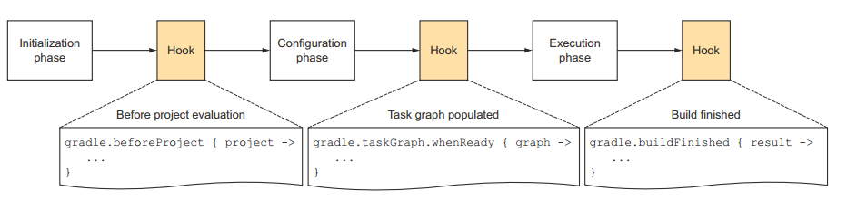

### Gradle 学习之旅

1. 什么是gradle？(what)

    &nbsp;&nbsp;&nbsp;&nbsp;&nbsp;&nbsp;&nbsp;gradle是一个基于groovy语言的项目构建框架，而groovy语言又是java语言的一种扩展，可以让我们使用脚本语言的一些特性来写java代码。由于groovy是基于java的语言，所以groovy的编译是依赖于JVM的。
    写好的groovy文件最后都会被编译成class文件。gradle的设计灵感来自于ant 和 maven。所以gradle算是后起之秀。groovy是一种DSL（领域特定语言）语言。那么什么是领域
    特定语言呢？例如：暗号，"今晚打老虎"，这句话对于某一领域人来说就是一句含有特殊意义的话，一般人会理解成"今晚要去把老虎打一顿"
    领域特定语言其实更类似于java代码中的封装的效果，对于这个方法来说，我们不需要知道方法内部是采用何种方法来实现的，只需要知道按照特定的写法
    能够实现某个特殊的功能就好了。毕竟在某一个领域，我们方法的调用这可能不是专业的，而且一些专业领域的描述或者表达也无法理解。所以有这个领域专业的人
    来实现这个方法，能够达到很好的效果。这就是我对groovy的DSL的理解。

2. 为什么要使用gradle? (why)
    
    既然gradle的设计灵感是来源于ant和maven的，那相比之下有什么优势呢？
+ gradle在做配置时更加简单，在maven中需要好几十行写的依赖文件，在gradle中只要几句话就可以完成。
+ gradle是基于DSL（领域特定语言）的，而maven是基于xml的，gradle的语法体验更好。
+ gradle可以在脚本中直接写逻辑，语法比较灵活，而maven的语法比较固定，无法在xml文件中写入一些逻辑代码
+ gradle脚本的生命周期中可以加入钩子函数，来添加一些额外的信息。

3. 什么时候使用gradle？(when)
   
   通过前面对gradle的了解，我们已经知道，gradle主要是用来做项目构建的。在我们开发过程中，我们要做的事情不仅仅只有写代码，完成业务逻辑等事情，其中还包括，项目的编译，测试，打包，部署，发布等过程。
   在这些过程中其实是存在这大量重复性的工作的。那么可不可可以把这些过程都自动化呢？显然，gradle就是来做这个工作的，通过用代码来描述工作的流程。最后我们只需要通过一个操作就可以完成所有的事情。即通过
   一个输入，得到多个产出物。所以在任何项目中我们都可以使用gradle来简化开发的过程。
   
4. 什么地方使用gradle？(where)

    java项目中可以使用，Android项目中，groovy项目中都可以使用gradle来管理

5. 怎么使用gradle来构建项目？(How)
    
    (1) 在Intelij中新建一个gradle项目
    
    (2) 完成build.gradle文件中的配置
    
    (3) 通过gradle中的task来构建项目
    
    

### Groovy知识介绍   
&nbsp;&nbsp;&nbsp;&nbsp;&nbsp;&nbsp;&nbsp;gradle是基于groovy语言的，所以我们需要先了解一下groovy的语法知识，才能更方便的学习gradle。
groovy又是结合java和脚本语言的语法，所以在学习的过程中，会发现，一些语法和python脚本语言十分类似。所以在初期接触的时候会有一点不习惯，不过看习惯之后就好了。

1. groovy中语法的结尾处可以不用写分号

2. groovy中的注释

    groovy中的注释和java中一样都是支持"//"，和"/**/"注释的 

3. groovy中的字符串的写法

    可以使用单引号，但是单引号不具有转义功能
    ```
    def name="zhagnsan"
    println 'hello $name' //hello $name
    ```
    使用双引号，具有转义功能
    ```
    def name="lisi"
    println "hello $name"  //hello lisi
    ```

3. groovy中如何定义数据类型？
    
    使用def可以定义所有java中的数据类型，当然通过java原生的语法来定义也是ok的。
    ```
    def var1="zhangsan"
    def var2=1
    def int index=0
    int item=1

    ``` 
4. groovy中如何定义函数？
    
    函数可以使用def来定义函数的返回值，函数中最后一行，默认是有return 语句的。同理，返回值的类型也可以不使用def，使用java原生的数据类型。
    groovy中的函数可以不指定参数类型。
    ```
    def show(name){
        "hello"+name
    }
    
    String showName(name){
       return "hello"+name
    }
    show("zhagnsan")  //hello zhangsan
    showName("zhagnsan")  //hello zhangsan
    ```
5. groovy中的集合类
    
    (1) List类，可以由不同类型的元素组成，使用[]定义
     ```
        def list=["lisi",23,'男']
        println list.size==3   //true
        println list[0]=="lisi"  //true   
     ```
     
     (2) Map类，由容器变两定义[key:value,key,value]
     ```
        def list=["name":"lisi","age":53,"sex":"男"]
        
        println list.name
        println list['name']
     ```
     注意：key值一定要是字符串才行
     
     (3) Range类，是List类的一种扩展，语法形式 def range=1..2 (两端的值都是包括的)
     
     ```
        def range=1..5
        println range[0]     //1
        println range.from   //1
        println range.end    //5
        
        def rangeWithoutEnd=1..<5
        println range.end   //4
     ```
     在groovy API中时并没有rang.from和range.to方法的，但是为什么我们可以使用from，to来调用呢？
     原因很简单，因为在groovy中属性是默认有get，set方法的，当我们看到有getFrom这个方法时，就证明了
     类中肯定是包含有成员变量from，和to的。没有公开et方法，说明这个成员变量不能被外界赋值
   
6. groovy中的闭包
    
    闭包在groovy中是一个很重要的概念，gradle中有很多地方都用到了闭包的特性。闭包
    的本质是一种数据类型，他是一段可执行的代码。
    
    (1) 闭包的语法
    ```
    //闭包有参数时的写法
    def closure={ name -> println name}
    closure("zhangsan")
    //闭包没有参数时的写法
    def closure1={ println "hello world"}
    closure1()
    ```
    (2) 闭包的调用
    ```
    closure.call("lisi");
    closure("lisi");
    ```   
    (3) 闭包没有参数时，会默认包含一个it参数相当于argument
    
    (4) groovy中函数的最后一个参数是闭包时，可以在调用函数时，省略();  
    
    
    
 ### Gradle学习

1. gradle 工作原理介绍

    gradle工作原理比较简单，主要是根据setting.gradle,build.gradle文件加载配置的过程，整个过程可以描述为下图：
   <div align="center">
           
   </div> 
   Gradle工作包含三个阶段:
 + 首先是初始化阶段。对我们前面的multi-project build而言，就是执行settings.gradle,解析项目中有几个子项目需要构建。
 
 + Configration阶段的目标是解析每个project中的build.gradle。比如multi-project build例子中，解析每个子目录中的build.gradle。在这两个阶段之间，我们可以加一些定制化的Hook。这当然是通过API来添加的。
 
 + Configuration阶段完了后，整个build的project以及内部的Task关系就确定了。恩？前面说过，一个Project包含很多Task，每个Task之间有依赖关系。Configuration会建立一个有向图来描述Task之间的依赖关系。所以，我们可以添加一个HOOK，即当Task关系图建立好后，执行一些操作。
 
 + 最后一个阶段就是执行任务了。当然，任务执行完后，我们还可以加Hook。
 
   最后，关于Gradle的工作流程，你只要记住：
 
 Gradle有一个初始化流程，这个时候settings.gradle会执行。
 在配置阶段，每个Project都会被解析，其内部的任务也会被添加到一个有向图里，用于解决执行过程中的依赖关系。
 然后才是执行阶段。你在gradle xxx中指定什么任务，gradle就会将这个xxx任务链上的所有任务全部按依赖顺序执行一遍！
    
> 如何在每一个步骤中加入钩子函数。这个在后面会涉及。

 
 2. Gradle编程模型及API实例详解 
    <div><a href="https://docs.gradle.org/current/dsl">gradle官方API文档</a></div>
    
    Gradle基于Groovy，Groovy又基于Java。所以，Gradle执行的时候和Groovy一样，会把脚本转换成Java对象。
    Gradle主要有三种对象，这三种对象和三种不同的脚本文件对应，在gradle执行的时候，会将脚本转换成对应的对象：
+ Gradle对象：当我们执行gradle xxx或者什么的时候，gradle会从默认的配置脚本中构造出一个Gradle对象。在整个执行过程中，只有这么一个对象。Gradle对象的数据类型就是Gradle。我们一般很少去定制这个默认的配置脚本。

+ Project对象：每一个build.gradle会转换成一个Project对象。

+ Settings对象：显然，每一个settings.gradle都会转换成一个Settings对象。

    注意，对于其他gradle文件，除非定义了class，否则会转换成一个实现了Script接口的对象
    
    当我们执行gradle的时候，gradle首先是按顺序解析各个gradle文件。这里边就有所所谓的生命周期的问题，即先解析谁，后解析谁
    
    
 3. Gradle对象详解
    