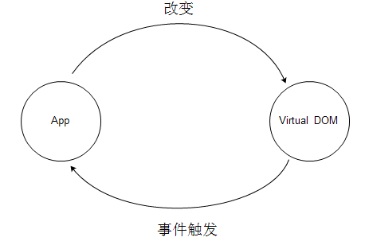

# ReactJS学习指南
## 一 初入React世界
### 1.1 什么是React?
&nbsp;&nbsp;&nbsp;&nbsp;&nbsp;&nbsp;React是FaceBook在2013年开源在Github上的Jacascript库。React把用户界面抽象成一个个的相互独立的组建。开发者可以通过重
用这些组建开构造功能丰富，可交互的页面。在页面中通过引入JSX语法，使得组件的复用变得十分容易，同时还能保证组件结构的清晰。
有了组件这一层的抽象，React把代码和真是渲染目标隔离开来，除了可以在浏览器端渲染到DOM来开发网页外，还能用于开发原生移动应
用。

#### 1.1.1 React是一个什么框架（MVVM?MVC?）?

+ MVC框架
```
    MVC是比较直观的架构模式，用户操作->View（负责接收用户的输入操作）->Controller（业务逻辑处理）->Model（数据持久化）
->View（将结果反馈给View）。在MVC架构模式中，对于view层和model层的代码复用都可以很容易的做到，但是对于controller层的代
码复用问题上确是会出现一些问题，在开发过程中，并不清楚controller层中的哪些代码会被复用到。所以并不是很好的抽取出可复用的代
码。其实MVC框架并不只是单纯的分为三层，也可以分为多层，将controller中可复用的代码在抽取为一层也是可以的。
```
+ MVVM框架
```
    MVVM是 Model-View-ViewModel 的简写。相对于 MVC 的历史来说，MVVM 是一个相当新的架构，MVVM 最早于 2005 年被微软
的 WPF 和Silverlight 的架构师 John Gossman 提出，并且应用在微软的软件开发中。当时 MVC 已经被提出了 20 多年了，可见两
者出现的年代差别有多大。MVVM 在使用当中，通常还会利用双向绑定技术，使得 Model变化时，ViewModel 会自动更新，而ViewModel
变化时，View 也会自动变化。所以，MVVM 模式有些时候又被称作：model-view-binder 模式。

    MVVM 在实际使用中，确实能够使得 Model 层和 View 层解耦，但是如果你需要实现 MVVM 中的双向绑定的话，那么通常就需要引
入更多复杂的框架来实现了。对此，MVVM 的作者 John Gossman 的 批评 应该是最为中肯的。John Gossman 对 MVVM 的批评主要有
两点：

    第一点：数据绑定使得 Bug 很难被调试。你看到界面异常了，有可能是你 View 的代码有 Bug，也可能是 Model 的代码有问题。
数据绑定使得一个位置的 Bug 被快速传递到别的位置，要定位原始出问题的地方就变得不那么容易了。

    第二点：对于过大的项目，数据绑定需要花费更多的内存。

某种意义上来说，我认为就是数据绑定使得 MVVM 变得复杂和难用了。但是，这个缺点同时也被很多人认为是优点。
```

&nbsp;&nbsp;&nbsp;&nbsp;&nbsp;&nbsp;和目前市场上主流的MVVM/MVC框架有所不同，React并不是一个完整的MVC/MVVM框架。为什么说React并不是一个完整的MVVM/MVC框架呢？原因是，React主要专注于提供一个一个清晰，简洁的视图（view）解决方案。但是React又与模版引擎有所差别，React不仅专注于视图层的问题，又是一个包含view和controller的库。在复杂应用中使用React时，可以根据应用场景自行选择业务层框架，并根据需要搭配Flux、redux来使用。

#### 1.1.2 React精髓之虚拟DOM。
&nbsp;&nbsp;&nbsp;&nbsp;&nbsp;&nbsp;真实的页面对应的是一颗DOM树，在传统的开发模式中，需要更新页面上的内容时，都需要手动来操作DOM进行更新。
<div align=center>
    
</div>
<div align=center>图1-1 传统DOM更新</div>
<p></p>
&nbsp;&nbsp;&nbsp;&nbsp;&nbsp;&nbsp;在前端开发中，DOM操作是非常昂贵的，性能消耗最大的就是DOM操作。如果业务逻辑比较复杂时，操作DOM的代码会变得难以维护。React通过将真实的DOM树转换成JavaScript对象，也就是更多Virtual DOM。
<div align=center>
    
</div>
<div align=center>图1-2 React DOM更新</div>

&nbsp;&nbsp;&nbsp;&nbsp;&nbsp;&nbsp;每次数据更新之后，都会重新对更多Virtual DOM进行计算，并和上一次生成的Virtual DOM进行比对，对发生变化的部分做批量更新。同时，React提供了直观的shouldComponentUpdate生命周期，来减少数据变化后不必要的Virtual DOM的比对过程，从而保证性能。

+ Virtual DOM性能比直接操作DOM的性能更好？
```
    虚拟DOM的性能其实并不一定比直接操作DOM的性能好。这需要分场合来说这个问题。例如在点赞功能的设计中，
很明显直接操作DOM要快的多，而在一个数量选择的场景中，点击+号数字加一，点击-号数字减1，点击确定按钮提交
更改。如果先点击+1，之后再点击-1操作。最后点击确定按钮时，这种情况下使用Virtual DOM并不会更新页面。
    React 的基本思维模式是每次有变动就整个重新渲染整个应用。如果没有 Virtual DOM，简单来想就是直接重置
innerHTML。很多人都没有意识到，在一个大型列表所有数据都变了的情况下，重置 innerHTML 其实是一个还算合理
的操作。真正的问题是在 “全部重新渲染” 的思维模式下，即使只有一行数据变了，它也需要重置整个 innerHTML，
这时候显然就有大量的浪费。
```

+ 使用Virtual DOM的优势在哪里？
```
    1) 为函数式的 UI 编程方式打开了大门；
    2) 可以很方便的和其他平台进行集成，可以通过React控件渲染成Android原生控件和IOS原生控件。
```
更多Virtual DOM是否更快的问题解析，可以查看链接<a href="https://www.zhihu.com/question/31809713/answer/53544875" target="_blank">操作真实DOM比React更快</a>

#### 1.1.3 React精髓之函数式编程
+ 什么式命令式编程？
```
    在过去，工业界的编程方式一直是以命令式编程的方式为主。命令式编程解决的式做什么的问题。
人脑最擅长的是分析问题，而电脑最擅长的是执行指令。电脑只需要几条汇编指令就可以算出我们需要
很长时间才能解出的运算。命令式编程就像是在给电脑下命令，如今主流的编程语言（包括C和Java等）
都是由命令式编程构建起来的。

```
+ 函数式编程
```
    函数式编程，对应的式声明式编程，它是人类模仿自己的逻辑思考方式发明出来的。例如当我们想要
将一个数组以从小到大的形式，进行重新排序并返回一个新的数组时。如果是计算机的思考方式，则会需
要一个新的数组，然后遍历元素依次找出最大值，次大值等，然后放进新数组。如果是人的思考方式，则是
通过构建一个规则，这个过程就转换成了如何构建一个参数为数组的函数f的过程。这样计算过程可以被重复
利用。
    React就将以前重复构造UI的过程抽象成了组件，并且能够在给定参数的情况下约定如何渲染UI界面。
React中就使用到了很多函数式编程的方法来减少冗余代码。由于，它本身就是简单的函数，所以测试过程
比较容易。函数式编程贯穿了整个react。
```

#### 1.2 JSX语法
&nbsp;&nbsp;&nbsp;&nbsp;&nbsp;&nbsp;JSX的官方定义式类XML语法的ECMAScript扩展。它完美的利用了JavaScript自带的语法和特性，并使用HTML语法来创建虚拟元素。但是react并不依赖JSX语法。即使脱离了它也能够进行使用。只是开发效率不够高而已。
+ DOM元素解析的过程

web页面是由一个个的HTML元素组成的，如果使用JavaScript来描述这些元素时，这些元素可以被描述为纯粹的JSON对象。例如如下示例：
```
    <button className='btn btn-blue'>
        <em>confirm</em>
    </button>
```    
转换成JSON对象时，依然需要包括元素的类型以及属性信息：
```
    {
        type:'button',
        props:{
            className:'btn btn-blue',
            children:[{
                type:'em',
                props:{
                    children:'confirm'
                }
            }]
        }
    }
```
有了元素的JSON对象信息后就可以在js中创建Virtual DOM元素了。

+ 组件元素的创建
    有了JSON对象信息后，就可以很方便的封装button元素了，利用函数式编程的思想可以得到一种构建按钮的公共方法：
```
    const Button=({color,text}=>{
        return {
            type:'button',
            props:{
                className:`btn btn-${color}`,
                children:[{
                    type:'em',
                    props:{
                        children:text
                    }
                }]
            }
        }
    })
```
&nbsp;&nbsp;&nbsp;&nbsp;&nbsp;&nbsp;如果需要在页面中调用button元素时，就可以很方便的使用Button({color:blue,text:'confirm'})来创建。其实仔细思考可以发现Button方法也可以作为元素而存在，方法名对应了元素的类型，参数对应了DOM元素的属性。这样构建的元素就是自定义类型的元素或组件元素。
&nbsp;&nbsp;&nbsp;&nbsp;&nbsp;&nbsp;“危险按钮”的组件元素的描述如下：
```
    const DeleteAccount-()=>{
        type:'div',
        props:{
            children:[
                {
                    type:'p',   
                    props:{
                        children:'Are you sure?'
                    }
                },
                {
                    type:"DangerButton",
                    props:{
                        children:'Confirm',
                    }
                },{
                    type:Button,
                    props:{
                        color:'blue',
                        children:'Cancel'
                    }
                }
            }]
        }
    }
```
&nbsp;&nbsp;&nbsp;&nbsp;&nbsp;&nbsp;上述格式使用JSX语法可以表示为：
```
    const DeleteAccount=()=>{
        <div>
            <p>Are you sure？</p>
            <DangerButton>confirm</DangerButton>
            <Button>Cancel<Button>
        </div>
    }
```
&nbsp;&nbsp;&nbsp;&nbsp;&nbsp;&nbsp;通过使用babel编译器将JSX语法文件编译成React可以执行的代码：
```
    var DeleteAccount=function DeleteAccount(){
        return React.createElement(
        'div',
        null,
        React.createElement(
            'div',
            null,
            'Are you sure?'
            )
        ),
        React.createElement(
            DangerButton,
            null,
            'Confirm'
            )
        ),
        React.createElement(
            Button,
            {color:'blue'},
            'cancel'
            )
        )
    }
```
&nbsp;&nbsp;&nbsp;&nbsp;&nbsp;&nbsp;通过以上写法可以看出JSX并不是强制选项，可以上上述代码一样直接书写而无需编译，但是这样书写太麻烦了且开发效率低。
