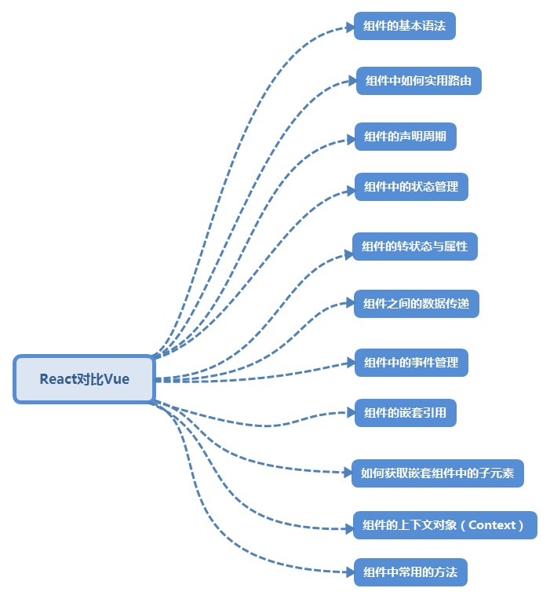

### 一、React和Vue的比较
      React和Vue都是目前市场上的主流框架。通过自己对React和Vue的学习之后，主要从如下几个方面来比较学习两个框架。

    

> 组件的基本语法

> 组件的路由 

> 组件的声明周期

> 组件的状态与属性

> 组件的状态管理

> 组件之间的数据传递

> 组件中的事件管理

> 组件间的嵌套引用

> 组件中子元素的引用

> 组件的上下文对象

> 组件中常用的方法