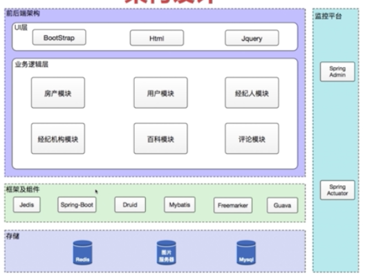
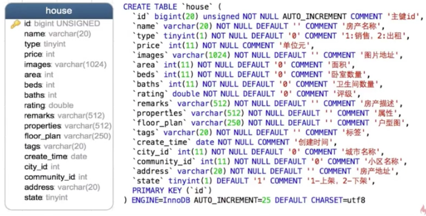
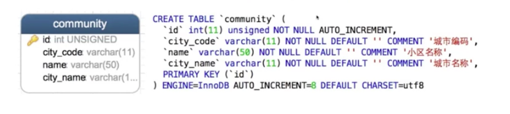
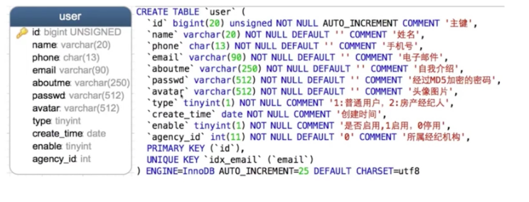
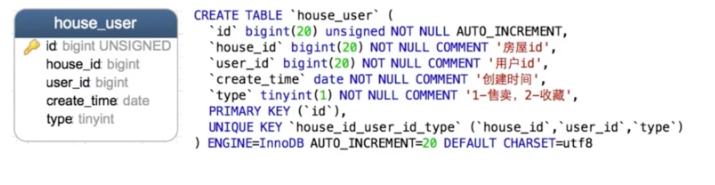
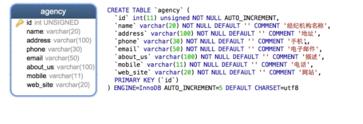
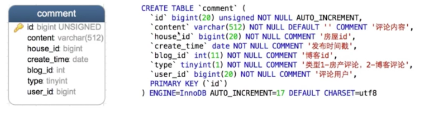
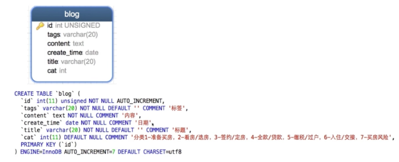

第一章： 单体架构值项目该要设计&&数据表设计
1. 学习目标
    
+ 掌握需求分析的过程
+ 掌握根据业务需求抽象出功能模型
+ 理清功能模型的关系和依赖

2. 需求分析

+ 功能：分析需要哪些功能

+ 模型：模型需要哪些属性，模型之间的关联关系

+ 流程：模型通过什么样的流程实现功能

3. 功能模型

&nbsp;&nbsp;&nbsp;&nbsp;&nbsp;&nbsp;&nbsp;&nbsp;&nbsp;&nbsp;
&nbsp;&nbsp;&nbsp;&nbsp;&nbsp;&nbsp;&nbsp;&nbsp;&nbsp;&nbsp;&nbsp;&nbsp;&nbsp;&nbsp;&nbsp;&nbsp;&nbsp;&nbsp;功能 &nbsp;&nbsp;&nbsp;&nbsp;&nbsp;&nbsp;&nbsp;&nbsp;&nbsp;&nbsp;&nbsp;&nbsp;&nbsp;&nbsp;&nbsp;&nbsp;&nbsp;&nbsp;&nbsp;&nbsp;&nbsp;&nbsp;&nbsp;&nbsp;&nbsp;&nbsp;&nbsp;&nbsp;&nbsp;&nbsp;&nbsp;&nbsp;&nbsp;&nbsp;模型
         
+ 房屋列表，房屋详情，房产收藏     ->     用户，房屋，小区

+ 经纪人列表，经纪人详情 &nbsp;&nbsp;&nbsp;&nbsp;&nbsp;&nbsp;&nbsp;&nbsp;&nbsp;&nbsp;-> 经纪人，用户，经纪人机构 
+ 评论列表，发布功能 &nbsp;&nbsp;&nbsp;&nbsp;&nbsp;&nbsp;&nbsp;&nbsp;&nbsp;&nbsp;&nbsp;&nbsp;&nbsp;&nbsp;&nbsp;&nbsp;&nbsp;-> 用户，评论，房屋，博客 
+ 用户登陆，用户注册 &nbsp;&nbsp;&nbsp;&nbsp;&nbsp;&nbsp;&nbsp;&nbsp;&nbsp;&nbsp;&nbsp;&nbsp;&nbsp;&nbsp;&nbsp;&nbsp;&nbsp;-> 用户，角色
+ 经济机构列表，经济机构详情 &nbsp;&nbsp;&nbsp;-> 经济机构
+ 房屋推荐 &nbsp;&nbsp;&nbsp;&nbsp;&nbsp;&nbsp;&nbsp;&nbsp;&nbsp;&nbsp;&nbsp;&nbsp;&nbsp;&nbsp;&nbsp;&nbsp;&nbsp;&nbsp;&nbsp;&nbsp;&nbsp;&nbsp;&nbsp;&nbsp;&nbsp;&nbsp;&nbsp;&nbsp;&nbsp;&nbsp;&nbsp;&nbsp;&nbsp;&nbsp;&nbsp;-> 用户，房屋
+ 博客列表，博客详情 &nbsp;&nbsp;&nbsp;&nbsp;&nbsp;&nbsp;&nbsp;&nbsp;&nbsp;&nbsp;&nbsp;&nbsp;&nbsp;&nbsp;&nbsp;&nbsp;&nbsp;-> 用户，博客

4. 模型之间的关系

    

       
    

    
5. 技术选型
    
&nbsp;&nbsp;&nbsp;&nbsp;&nbsp;&nbsp;技术选型关注点：

+ 满足需求场景

+ 分析秀缺点

+ 成熟度稳定性

+ 活跃度

+ 团队技术栈

  技术选型：
    
+ spring boot：帮助快速敏捷开发spring应用，开箱即用

+ spring mvc： 实现mvc设计模式的请求驱动轻量级的web框架

+ Guava：java工具类集的基础库

+ Mybatis：Java持久层框架，提供java对象与数据库实体的映射

+ Druid：为监控而生的数据库链接池

+ FreeMaker： 基于模版生成html的模版引擎

+ Nginx：反向代理服务器（储存静态资源）

+ Redis： key-value缓存系统

+ Jquery：javascript工具库

6. 架构设计

   

       
    

    
    
7. 数据库设计

    （1）房产表设计
    
     

           
     

    
    （2）小区表
    
      

               
         

         
    （3）用户表
    
      

               
         

    （4）房产用户表
     

         
     

    （5）房产留言表
     

         
     

    （6）经济机构表
     

          
     

         
    （7）评论表
       

           
       

       
    （8）百科表
     

         
     

    
    

